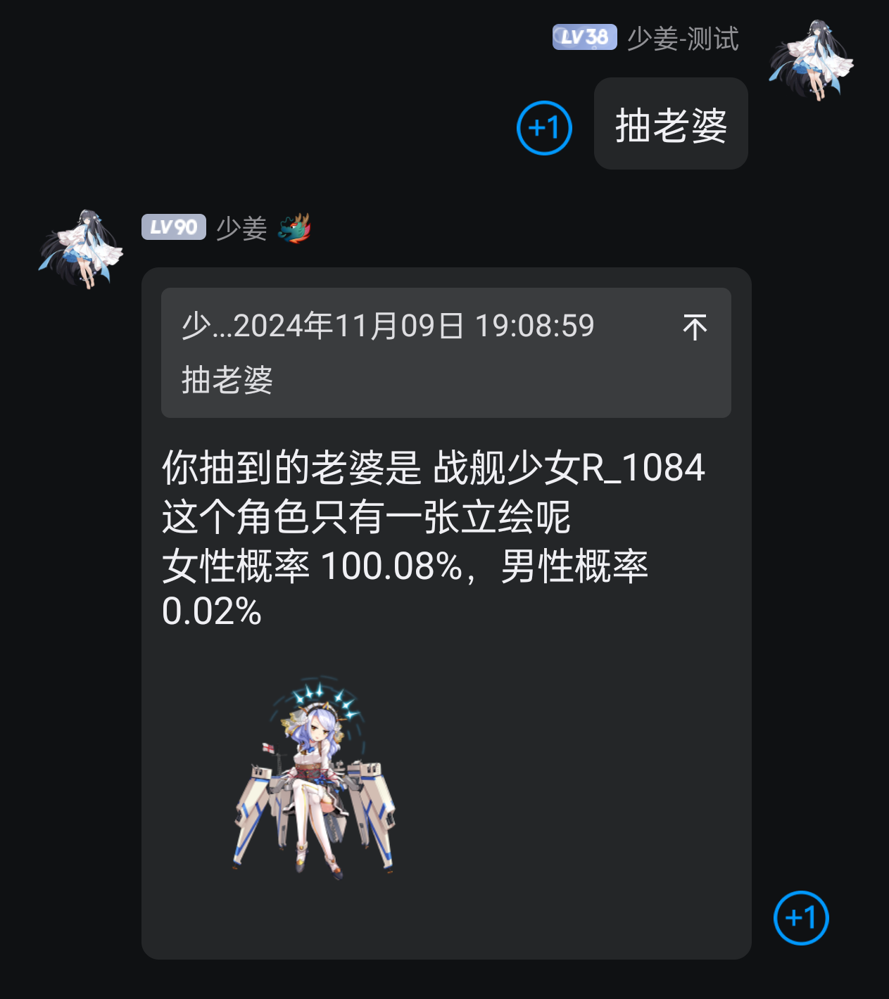
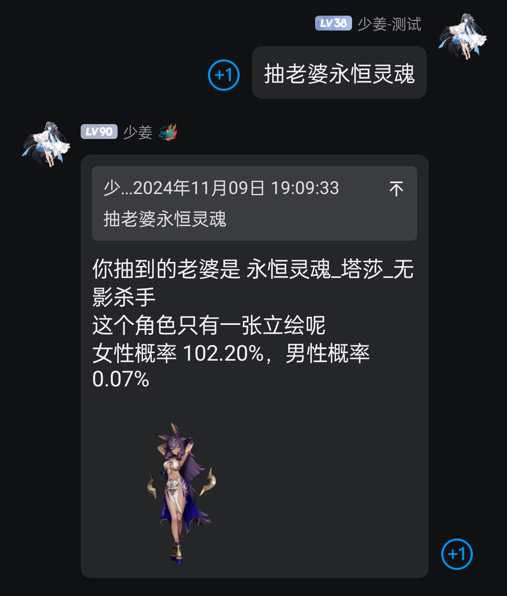
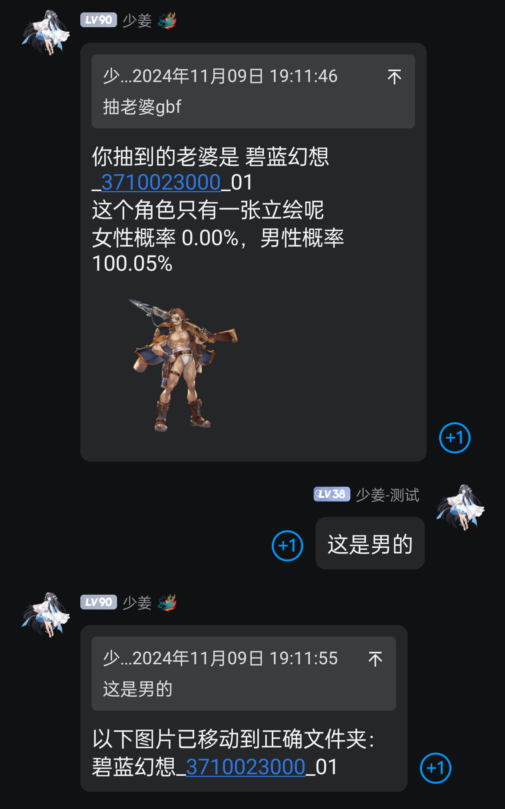
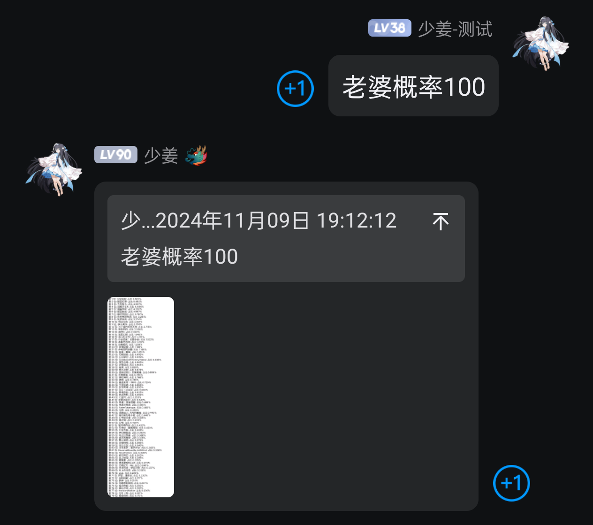
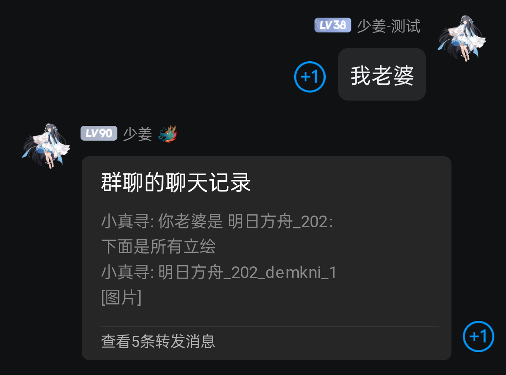
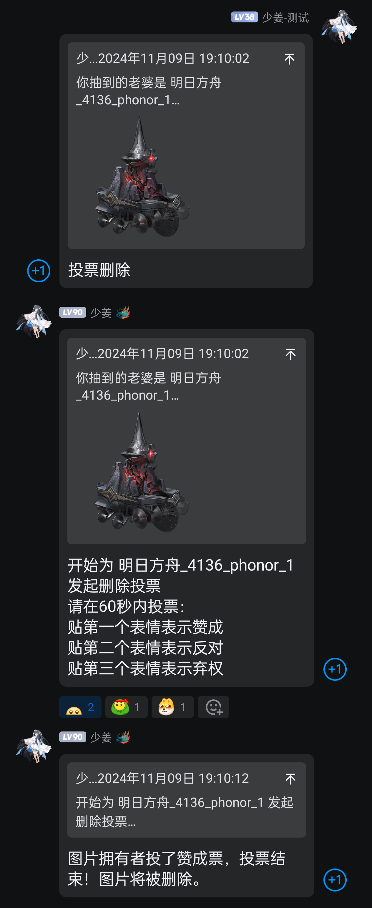

# zhenxun_plugin_draw_painting

_✨ 真寻机器人的游戏立绘抽卡插件 ✨_

## 📖 简介

一个基于真寻机器人的游戏立绘抽卡插件。通过该插件，用户可以：
- 随机抽取游戏角色立绘
- 查看已抽取角色的全部立绘
- 支持性别区分功能
- 支持投票删除不当图片

## 🚀 特性

- 支持男性/女性角色立绘分类
- 角色名称自定义修改
- 游戏占比统计功能
- 群投票删除机制

## 💿 安装

### 方式一：直接克隆

手动安装

    git clone --depth=1 https://github.com/PackageInstaller/zhenxun_plugin_draw_painting.git

## ⚙️ 配置步骤

1. 安装依赖：

    `pip install -r requirements.txt`

2. 下载模型：
   - 从[此处](https://github.com/AUTOMATIC1111/TorchDeepDanbooru/releases/download/v1/model-resnet_custom_v3.pt)下载模型文件
   - 将下载的文件放入 `Model` 文件夹

## 🎮 使用指令

| 指令 | 说明 | 权限 | 使用范围 |
|------|------|------|----------|
| 抽老婆/老公 | 随机抽取游戏角色立绘 | 群员 | 群聊 |
| 我老婆/老公 | 查看已抽取角色的全部立绘 | 群员 | 群聊 |
| 老婆/老公改名 | 修改角色ID为正确名称 | 群员 | 群聊 |
| 老婆/老公概率 [可选数量] | 查看各游戏占比 | 群员 | 群聊 |
| 这是男的/女的 | 修正角色性别标记 | 群员 | 群聊 |
| 投票删除 | 发起删除不当图片的投票 | 群员 | 群聊 |

## 📸 效果展示

点击查看效果图

## 📋 系统要求

- 适量的立绘素材库
- 足够的内存/显存空间

## 🙏 致谢

- [nonebot2](https://github.com/nonebot/nonebot2) - 机器人框架
- [真寻Bot](https://github.com/HibiKier/zhenxun_bot) - 原型机器人
- [TorchDeepDanbooru](https://github.com/AUTOMATIC1111/TorchDeepDanbooru) - 深度学习模型

## 📝 更新日志

### v1.0
- 初始版本发布
- 实现基础抽卡功能
- 添加性别区分功能
- 实现投票删除机制

## 📄 开源协议

本项目遵循 MIT 协议开源。
