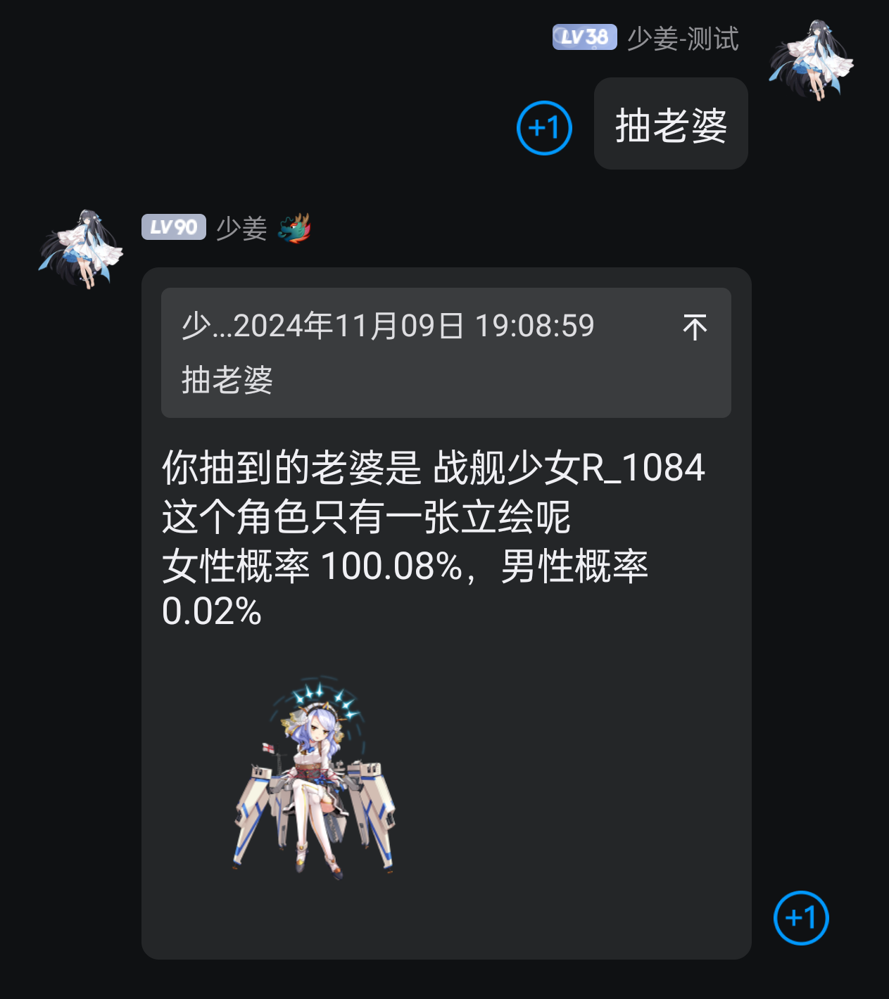
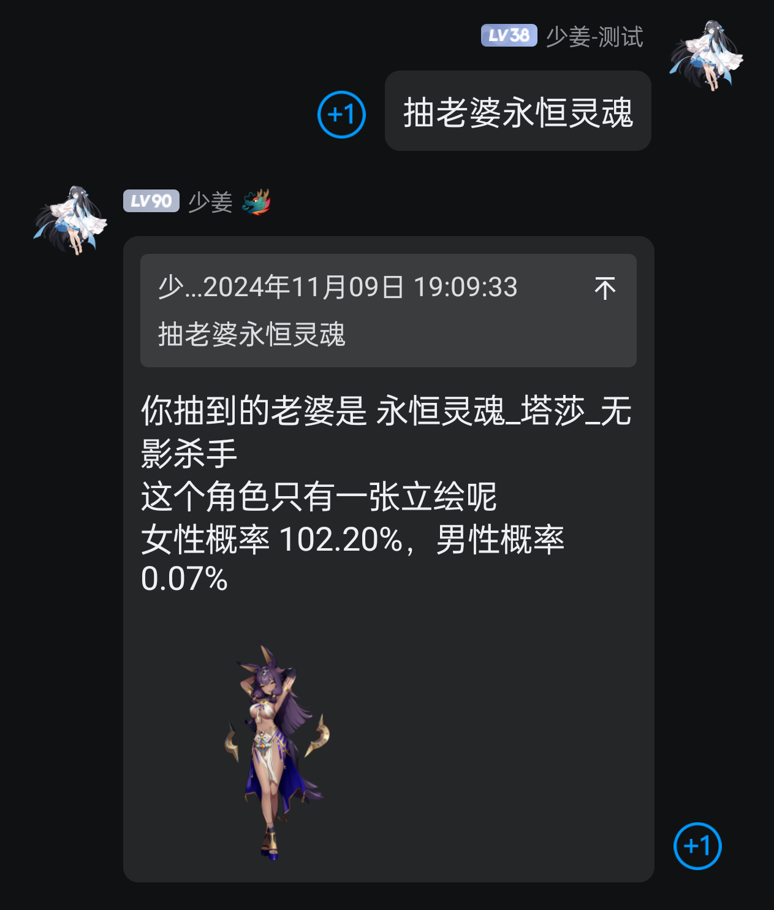
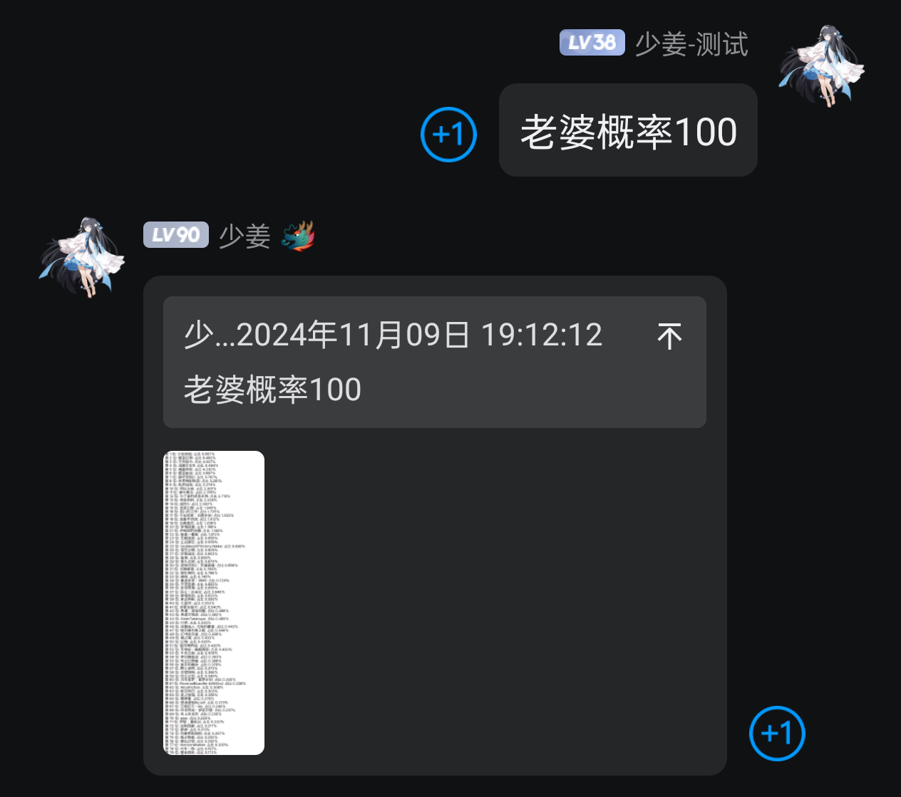
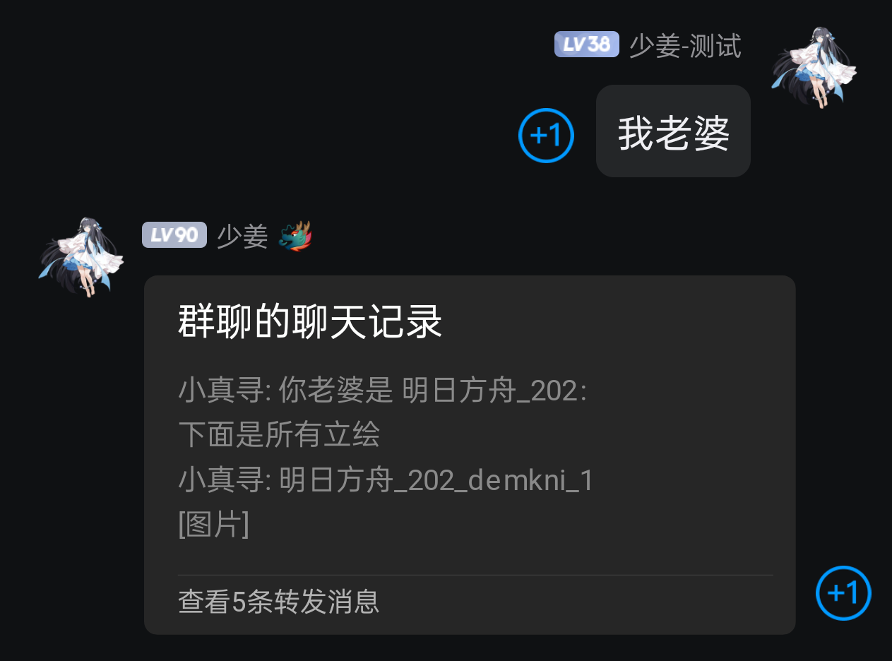

# zhenxun_plugin_draw_painting

`-n` 未找到完整名或名称片段时，还会尝试少量错字近似匹配，例如“妮菲娅”匹配
“妮菲亚”。至少输入 3 个文字或字母；根据名字长度容忍 1～2 处增删改字。
最接近的名字不唯一时提示候选，需补充名字；已被抽走的角色仍不能重复抽取。

`-n` 支持角色名称片段，完整名称优先；匹配忽略英文大小写、空格和装饰符号。
例如 `抽老婆碧蓝航线 -n shooter` 可匹配 `BLACK★ROCK SHOOTER`，也可输入
`black rock`。片段匹配多名角色时从尚未被抽走且满足 `-t` 的匹配立绘中随机抽取。
只搜索指定游戏的角色名，不搜索皮肤名或备注；已被抽走的角色不能通过缩写重复抽取。

男女整图融合评分均严格低于 30% 时，从 `wives/` 或 `husbands/` 移至 `Others/`，
不再参与抽取与立绘打包。融合使用 WD 40% + Camie 60% 的原始性别评分；恰好
30%、评分缺失或识别失败均不满足此规则。未检测到主体时也必须有完整的整图
模型评分，不能将未计算的 0% 当作低分。

启动复查旧记录，运行时处理新增图片；`Others/` 作为归档目录不加入识别队列。
同名且 MD5 相同则覆盖，内容不同添加 `_重复N`。原有 `drop/` 文件及历史记录保留。

_✨ 真寻机器人的游戏立绘抽卡插件 ✨_

## 📖 简介

一个基于真寻机器人的游戏立绘抽卡插件。通过该插件，用户可以：

- 随机抽取游戏角色立绘
- 查看已抽取角色的全部立绘
- 支持性别区分功能

## 🚀 特性

- 支持男性/女性角色立绘分类
- 角色名称自定义修改
- 游戏占比统计功能
- 按游戏与人物名定向抽取
- 游戏别名动态维护
- 男女立绘打包、共享缓存与 1 天对象存储链接
- WD SwinV2 + Camie v2 融合标记，并先检测二次元人物、分离画面与主体特征
- 启动补扫与运行时新增立绘监控，主体性别融合评分 >70% 自动纠正男女目录

## 💿 安装

### 方式一：直接克隆

手动安装

    git clone --depth=1 https://github.com/PackageInstaller/zhenxun_plugin_draw_painting.git

## ⚙️ 配置步骤

1. 安装依赖：

   `pip install -r requirements.txt`

## 🎮 使用指令

| 指令 | 说明 | 权限 | 使用范围 |
| --- | --- | --- | --- |
| 抽老婆/抽老公 [游戏名] | 随机抽取全部或指定游戏的角色立绘 | 群员 | 群聊 |
| 抽老婆/抽老公 [游戏名] -n [人物名] | 定向抽取指定人物 | 群员 | 群聊 |
| 抽老婆/抽老公 [游戏名] -t [特征...] | 按一个或多个特征组合筛选立绘 | 群员 | 群聊 |
| 立绘特征列表 | 合并转发分类展示中文名、英文标签与别名 | 群员 | 群聊 |
| 特征查询 + 图片 | 实时分析用户上传的任意图片，仅返回特征标注图；支持回复图片 | 群员 | 群聊 |
| 查看老婆/查看老公 | 查看已抽取角色的全部立绘，合并转发每批最多 30 张 | 群员 | 群聊 |
| 老婆改名/老公改名 | 修改角色 ID 为正确名称 | 群员 | 群聊 |
| 老婆概率/老公概率 [可选数量] | 查看各游戏占比 | 群员 | 群聊 |
| 打包立绘 [游戏名或别名] | 打包男女立绘并生成 1 天下载链接 | 群员 | 群聊 |
| 别名添加 [原游戏名] [别名...] | 去重后写入一个或多个游戏别名 | 超级用户 | 群聊 |
| 帮助抽游戏立绘 | 查看完整帮助 | 群员 | 群聊 |

`立绘特征列表` 使用聊天记录合并转发，按类别拆分节点，并显示中文名、英文标签
及别名。`-t` 支持中英文混用，例如 `抽老婆 -t 粉发 粉瞳 看向观众 发饰 手持物品 water`。
英文多词标签使用下划线。匹配以数据库中已记录的主体标签为准，不以肉眼特征为准；
缺少任一条件都会排除该图片。例如目标图没有 `armor` 标签时，添加“铠甲”就无法匹配。

特征筛选采用 AND 组合，例如 `抽老婆 原神 -t 白发 长发 平胸`。特征之间
也可以使用逗号、顿号或 `+`；可以与 `-n` 同时使用。中文名称由
`config/feature_aliases.yaml` 维护，未映射的新标签仍可直接填写英文原始名称。
目前提供 435 个模型通用标签的中文名称与别名，覆盖发型、眼睛、服装细节、鞋袜、
武器、动作、画面元素与背景等。例：`水` / `water`、`持剑` / `holding_sword`、
`分离袖` / `detached_sleeves`、`球鞋` / `sneakers`；同一标签中英文重复输入会去重。
`蝴蝶结` 对应 `bow`，`弓` 对应 `bow_(weapon)`，避免混淆。
名称映射也用于标注图；修改映射后重启机器人生效，无需重新识别或重建特征索引。
特征索引使用图片整数 ID 存储，不会在每条标签中重复完整路径；旧数据库会在
下次启动时自动迁移并压缩；单独的存储结构迁移无需重新识别图片，但下述多模型
升级涉及识别语义变化，需要重新标记。

### 查询用户上传的图片（不需要在图库中）

在同一条消息发送 `特征查询` 并附带一张图片；也可以回复一条带图消息，发送
`特征查询`。`+` 只是表示附图，可以省略。不需要游戏名、角色名或图库记录。

- 复用本机 GPU 的人物检测、WD / Camie 模型，现场分析收到的图片，不是搜索图库。
- 正常结果只回复一张图片，不再另发长段文字或处理提示。开始处理贴表情 `282`，
  成功发送结果后贴 `478`，失败贴 `479`；缺图、队列满或失败保留简短说明。
  反应接口不受支持时仍继续发送结果，贴表情的实现与立绘打包共用。
- 单人图展示主体/整图特征；多人图展示去重人脸框、女性/男性/未确认计数、
  每个人的评分及区域特征。所有通过现有融合规则且评分 ≥50% 的特征均展示，
  按分数降序排列，不限制条数；长标签自动换行，卡片与画布随内容扩展。
  50% 仅为显示门槛，不修改性别判定、特征入库和自动移库规则。
  没有中文映射的标签保留英文。整图人数标签如
  `6girls` 不作为真实人数，也不与逐人计数混排。
- 多人查询额外使用 [DeepGHS anime face v1.4_s](https://huggingface.co/deepghs/anime_face_detection)
  （MIT，固定修订、44.6 MB，SHA-256 校验），按 0/90/180/270 度与宽图重叠窗口
  检测、映回原图去重。原始门槛 0.307；低于 0.5 的候选需至少两次扫描支持。
  去重优先保留完整脸框，切图边缘截断的半脸只作为已有完整脸的支持证据，避免
  一张大脸因切图被计成两人；原图边界不视为切图截断。
  大图仅发现小脸/未发现脸，或整图人数标签 ≥50% 提示可能漏人时，额外扫描
  9 个半幅大小、重叠 50% 的窗口（含方形图），每个窗口仍做四向检测。
  人数标签只触发补检，不直接增加人数；镜像、画中人物仍可能被视为独立可见形象。
  随后逐脸用 WD/Camie 识别，混入多人时缩紧区域复核，不按整图的性别标签分配。
- 逐人查询使用 `face-census-v3`：根据邻近人脸的位置限制头发/肩部裁剪的扩张，
  支持四向旋转，保留完整目标脸；缩紧复核也使用相同的邻人边界约束。
  邻近脸框本身重叠且无法安全隔离时，保留未确认，不强行归属标签。
  这不是实例分割，仍不能保证完全排除邻人的头发、衣服或遮挡肢体。
- 单人性别判断与显示仅使用 `1girl` / `1boy`，不把 `multiple_girls`、`2girls`
  或 `male_focus` 等区域标签当作个人性别分。多人标签 ≥60% 的保护仍保留。
  报告分别显示多人污染、邻脸重叠、性别证据不足或推理失败；污染区域不展示
  无法归属的个人分数。复核未通过时，使用最新有效裁剪结果而非旧的大区域评分。
- 查询图中实线框表示人脸定位，虚线框表示实际采用的逐人判定裁剪范围，
  同一人的框与特征卡片使用相同颜色、编号。收紧后标注“复核范围”；卡片列出
  原图坐标 `(左, 上, 右, 下)`。这些矩形展示邻人避让边界，不是完整人体分割掩码。
- 查询计数允许可靠人脸（检测 ≥ 0.6 且扫描支持 ≥ 2）在两个模型目标性别均 ≥ 0.7、
  各自领先另一性别 ≥ 0.25 时计入性别估计；模型分歧仍记未确认。此规则只用于
  查询，不写库、不放宽主体筛选或自动移库的阈值。最多逐人分析 24 张脸，超出
  部分计入未确认；背脸、完全遮挡和极小人物仍可能漏检。
- 主体未确认时明确说明原因；未计算的性别不再显示为两个 `0%`。上半身裁剪得到
  的特征仅描述该区域，不代表全身；模型评分不是经过校准的真实概率。
- 不修改上传原图，不写入立绘特征库，不触发分类移库；临时文件在处理完成/失败
  后清理。每次一张、最多 20 MB / 2400 万像素，动态图只分析首帧。
- 同一用户只能有一个待完成请求，最多三个查询占用队列；与后台模型共享串行
  推理锁，不重复加载 WD/Camie；人脸会话首次查询时加载，CUDA arena 额外上限
  0.25 GiB。图片链接仅接受 QQ 附件 CDN。

### 主体识别与多模型升级

- 自动归档使用可信主体的融合性别标签：男性标签最高分 >70% 时从 `wives`
  移至 `husbands`，女性标签最高分 >70% 时反向移动，恰好 70% 不移动。
  对应性别必须与已确认的主体性别一致；另一性别不得 >70%，且分差至少 10 个
  百分点。不是使用整图标签，也不是使用两个模型性别评分的较低值。
- 启动时复查已打标但放错目录的记录，按新归档规则复用缓存处理，不强制全库
  重新推理；原有同名图片 MD5 去重和 `_重复N` 重命名逻辑不变。

本次升级会改变识别版本，旧的整图标签**不能当作主体标签复用**。重启后在后台
逐步重新识别现有图片，Rich 显示进度；尚未完成新版本识别的图片暂不参加 `-t`
筛选，普通随机抽取仍可使用。

- 人物检测：[DeepGHS anime person v1.3_s](https://huggingface.co/deepghs/anime_person_detection)。
- 特征融合：[WD SwinV2 v3](https://huggingface.co/SmilingWolf/wd-swinv2-tagger-v3)
  与 [Camie v2](https://huggingface.co/Camais03/camie-tagger-v2)。两套词表合并后
  支持 30,920 个英文通用标签，另有中文常用特征映射；这不是身体特征的数量。
- 根据人物框的面积、位置和检测置信度选择主体；较弱但明显占据主体的框允许
  进入复核。重叠/较弱的候选会局部再次检测，面积和交并比约束防止切换到配角。
  必要时保留头部与躯干、避开侧面配角后再次分类，不用头肩小图直接替代主体。
  主次不明、无法隔离、裁剪仍有多人或模型/视角冲突时继续标记不确定，
  不参加主体筛选和自动移动。几何裁剪不是人物分割，仍可能漏检或误判。
- `抽老婆 -t ...` 要求主体明确为女性；`抽老公 -t ...` 要求主体明确为男性。
  `画面多女`/`画面多男` 是明确的整图人数条件，其余特征均来自主体。
- 两模型共有的主体标签要求 WD ≥ 0.35 且 Camie ≥ 0.492；独有标签要求 ≥ 0.7。
  主体性别要求两者一致且各自 ≥ 0.65、另一性别均 < 0.35；或者双方目标评分
  均 ≥ 0.85，且各模型中目标比相反性别高 ≥ 0.30。自动移动要求主体明确、
  原始主体性别分按 WD 40% + Camie 60% 融合后目标 > 70%，另一性别 ≤ 70%，
  两者差值 ≥ 10%。不把过滤掉的相反性别标签当作零分。
  男女评分独立，不要求相加为 100%。规则版本升级至 `subject-fusion-v2`，
  重启后旧记录会在后台逐步重新识别，查询临时上传图片则直接使用新流程。
- CUDA arena 上限合计 9.5 GiB（WD 3.5、Camie 5.5、检测 0.5），
  使用特征查询的人脸会话后合计 9.75 GiB。这是内存池上限，不是实际显存保证值；
  CUDA 上下文、工作区及其他插件另有开销，不强制占满显存。
  后台每批 8 张，将跨图片的整图/主体裁剪合并推理；4 线程预处理减少 GPU 等待。
  显存不足或批量失败时自动拆分并降低后续批量。
- 长时间识别时，ONNX 在批次形状变化或每 32 次运行后回收闲置 CUDA arena，
  关闭动态形状的内存模式缓存；单张仍显存不足时，先释放旧会话再重建重试。
  重建失败进入 60 秒冷却，后台保留原任务并暂停推理，目录监控不停止；
  不把资源不足记作图片损坏、不保存单模型残缺结果，也不自动移动这些图片。
  重启后自动重新排队历史 OOM 错误，已成功标记的记录继续复用，无需清库。
  运行中的进程不会自动热更新这些改动，需要正常重启后生效。
- 主体弱检测增加同位置局部重检测；检测框修正后重新判断主次及重叠，
  不沿用旧框结论。无法区分主次的多人图仍保留不确定，不按整图多数性别归档。
  本次只对旧的弱检测、暂定和重叠主体记录补做一次识别，不全库清空。
- Others 仍要求两个原始整图融合性别分都 < 30%；若主体分任一 ≥ 30%，
  保守留在原目录，避免背景占比大导致人物被移入 Others。
- `1girl`/`1boy` 是独立图片标签，并不是“主体是人”的概率。若整图融合标签中
  `no_humans` ≥ 80%，或 `no_humans` ≥ 65% 且动物、宝可梦式生物、非人形机器人、
  纯风景等非人标签至少一项 ≥ 50%，则非人证据优先，直接归档至 Others；
  `monster_girl`、`robot_girl`、`mecha_musume` 等人形标签不作为非人佐证。
  启动复查会复用数据库已有标签，因此旧图片无需重新推理即可按此规则归档。
- 所有识别均在本机完成，图片不会发送到模型托管服务。仅下载固定版本权重，
  加载前校验 SHA-256。权重许可证分别见上游仓库（Camie 为 GPL-3.0）。

### 直接替换、删除或改名图片

文件格式为 `游戏名_角色名_立绘或变体名_备注1_备注2_....png`。角色名之后的
下划线段数量不限；游戏名、角色名自身不要再含下划线。

启动及运行时每 15 秒核对一次成功读取的目录（目录不可访问时跳过清理）：

1. 图片被替换或删除，旧标签立即退出后续特征检索。
2. 缺失记录保留 24 小时；若只是改名且 SHA-256 相同，新路径直接复用同版本识别。
3. 持续缺失超过 24 小时，批量删除特征记录及标签索引。抽卡历史不删除，也不会
   猜测无可读角色名的旧抽取记录应该改成哪个新名字。
4. 推理结束前再次核对文件大小和修改时间，防止识别旧图后把结果写给替换的新图。

### 迁移机器人安装目录

特征库使用 `wives/文件名.png`、`husbands/文件名.png`、`others/文件名.png`
作为路径键，不再绑定盘符或安装目录。首次启动会先生成
`data/image_features.pre_relative_paths.bak`，再事务迁移旧绝对路径并合并重复记录。
迁移时请停止旧机器人，将图库与 `data/image_features.db` 一起搬走，再启动新位置的机器人；
不要让新旧版本同时写同一数据库。SQLite WAL 文件若仍存在，也应随数据库保留。
文件内容、模型版本不变时复用特征；仅修改时间变化会校验 SHA-256 后复用，不重新跑模型。
上述相对路径规则只针对立绘特征库，不代表抽取历史等其他数据库也已迁移。

### 大图小人物补检

整图没有可靠的大人物框时，1024 像素及以上图片会启用按需补检：

- alpha 只用于寻找有效内容边界；不修改原图、不把 alpha 当人物掩码。
  检测框始终映射回原图坐标，原有白底合成处理保持不变。
- 先补检有效区域，再用 1024×1024、25% 重叠切片；候选人物周围增加
  640 像素起的居中局部复检，恢复切片边缘被截断的身体。
- 同一人物的重复框合并，优先保留完整框；只有边缘残框而无完整证据时不采纳。
  小于整图 8% 的框，需要至少两个不同区域的完整检测支持、最高置信度 ≥ 0.55、
  原图框短边 ≥ 64 像素，才允许进入原有主体判定流程。
- 每张图片最多 36 次额外检测，逐片复用已有检测模型，不增加常驻模型或切片批量。
  达到补检预算而未完成时，禁止根据这次结果自动归档。
- 结果中的 `analysis.detection` 记录补检版本、次数和预算状态。
  首次启动只让 wives/husbands 中旧的大图无人物、弱检测、暂定记录补做检测，
  正常缓存不清空；已经放进 Others 的旧图片不自动搬回。

本阶段没有增加角色身份匹配、实例分割或多人主次排序；可靠大人物已检出的图片
仍走原有快速路径，因此不保证发现它旁边的所有小配角。

## 🧩 代码结构

插件采用“入口注册、处理器编排、领域服务、持久化”分层。详细边界和扩展方式见
[ARCHITECTURE.md](ARCHITECTURE.md)。

## 📸 效果展示

点击查看效果图

## 📋 系统要求

- 网络环境良好(下载模型需要)
- 适量的立绘素材库
- 推荐 NVIDIA GPU 与 CUDA 12；无 CUDA 时可回退 CPU
- 使用 CUDA 12 时需保持 `onnxruntime-gpu>=1.21,<1.27`

## 🙏 致谢

- [nonebot2](https://github.com/nonebot/nonebot2) - 机器人框架
- [真寻Bot](https://github.com/HibiKier/zhenxun_bot) - 原型机器人
- [WD SwinV2 Tagger V3](https://huggingface.co/SmilingWolf/wd-swinv2-tagger-v3) - Danbooru 动漫多标签模型

## 📝 更新日志

### v1.0

- 初始版本发布
- 实现基础抽卡功能
- 添加性别区分功能

## 📄 开源协议

本项目遵循 MIT 协议开源。
